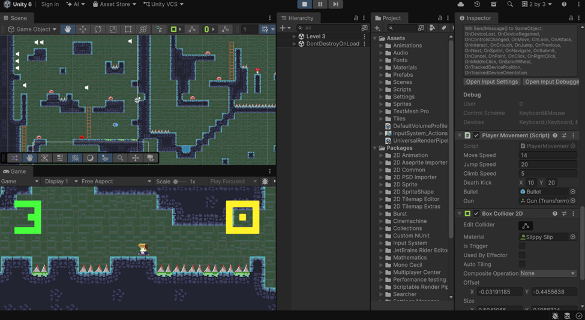
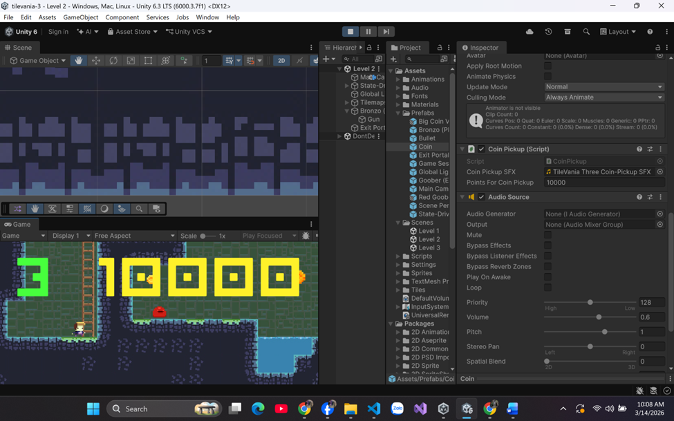
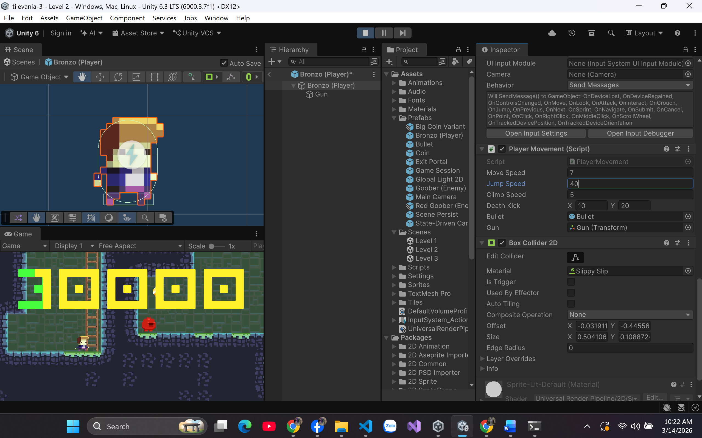
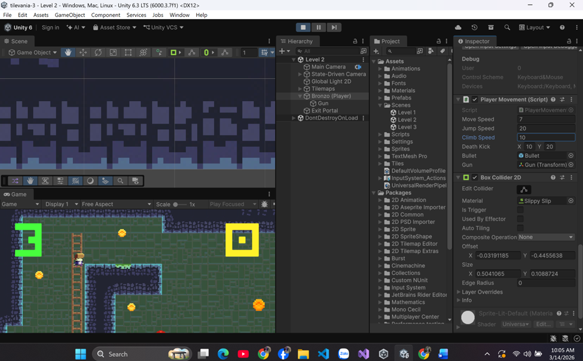

# BÁO CÁO THỰC HÀNH LAB 02
**Tên dự án:** Tìm hiểu về dự án TileVania 3
**Môn học:** Game 2D Development with Unity

---

## THÔNG TIN NHÓM SINH VIÊN

| Họ và tên | Mã số sinh viên | Lớp |
| :--- | :--- | :--- |
| Phan Trung Hiếu | 2312611 | CTK47A |
| Nguyễn Ngọc Trường Dân | 2312590 | CTK47A |
| Nguyễn Hưng Thịnh | 2312756 | CTK47A |

---

## 1. MÔ TẢ DỰ ÁN

Bài thực hành tập trung vào việc khám phá và phân tích dự án game **TileVania** - một nguyên mẫu trò chơi thuộc thể loại Platformer 2D. 

Mục tiêu cốt lõi của bài Lab là tìm hiểu sâu về kiến trúc dự án Unity, phân tích chức năng của các thành phần (Components), luồng thực thi của mã nguồn (Scripts), đồng thời tiến hành can thiệp, tinh chỉnh các thông số vật lý nhằm thay đổi trải nghiệm trò chơi (Game Feel).

---

## 2. CÁC TINH CHỈNH THÔNG SỐ VẬT LÝ

Nhóm đã can thiệp vào mã nguồn và cấu hình trên Inspector để thay đổi các thông số sau:

* **Tốc độ chạy (Move Speed):** Tăng từ `7` lên `14`.
* **Tốc độ nhảy (Jump Speed):** Tăng từ `20` lên `40`.
* **Tốc độ trèo thang (Climb Speed):** Tăng từ `5` lên `10`.
* **Điểm thưởng thu thập (Points For Coin Pickup):** Tăng từ `100` lên `1000`.

### Minh chứng thực hành (Screenshots)

* Hình ảnh thay đổi Move Speed:

* Hình ảnh Points For Coin Pickup:

* Hình ảnh thay đổi Jump Speed:

* Hình ảnh thay đổi Climb Speed:

---

## 3. KIẾN THỨC TÍCH LŨY

Qua quá trình phân tích và thực hành, nhóm đã củng cố các mảng kiến thức sau:

1. **Quản trị cấu trúc dự án:** Hiểu rõ cách phân bổ tài nguyên khoa học thông qua hệ thống thư mục cốt lõi của Unity (`Assets/Prefabs`, `Scripts`, `Sprites`, `Animations`).
2. **Hệ thống Vật lý 2D (Physics 2D):** Ứng dụng thực tiễn `Rigidbody2D`, `BoxCollider2D` và `CapsuleCollider2D` trong việc xử lý trọng lực, va chạm và nhận diện các lớp môi trường (Ground, Hazards).
3. **Thiết kế Màn chơi (Level Design):** Nắm bắt phương pháp xây dựng địa hình với công cụ Tilemap và Rule Tile.
4. **Mẫu thiết kế phần mềm (Design Patterns):** Nhận diện và hiểu được tính ứng dụng của **Singleton Pattern** trong việc quản lý trạng thái, điểm số, và vòng đời của trò chơi thông qua class `GameSession`.
5. **Giao diện & Hệ thống tương tác (UI & Input):** Nắm vững cách quản lý luồng sự kiện (di chuyển, nhảy, trèo) và phương thức đồng bộ hóa dữ liệu từ logic game lên giao diện người dùng (Canvas/Text).

---

## 4. KẾ HOẠCH BÁO CÁO (DỰ KIẾN)

Cấu trúc bài thuyết trình được chia thành 9 phần, tập trung vào phân tích kỹ thuật và demo thực tế:

| Slide | Tiêu đề | Nội dung trọng tâm |
| :--- | :--- | :--- |
| **1** | **Trang bìa** | Tên bài thực hành, thông tin thành viên, thông tin lớp học. |
| **2** | **Tổng quan TileVania** | Giới thiệu nguyên mẫu, thể loại Platformer 2D, nền tảng Unity & C#. |
| **3** | **Cấu trúc dự án** | Phân tích sơ đồ thư mục `Assets/` và chức năng các tài nguyên cốt lõi. |
| **4** | **Kiến trúc & Design Patterns** | Phân tích sâu về Singleton pattern trong `GameSession` và `ScenePersist`. |
| **5** | **Character System** | Giải phẫu mã nguồn `PlayerMovement.cs` (Input, vận tốc, xử lý va chạm). |
| **6** | **Enemy & Collectables** | Cơ chế hoạt động của thực thể AI (Goober, Red Goober) và hệ thống vật phẩm. |
| **7** | **Level Layout & Tilemap** | Phương pháp xây dựng bản đồ và quản lý Layer mask (Ground, Climbing, Hazards). |
| **8** | **Thực nghiệm tinh chỉnh** | Trình bày các thay đổi thông số vật lý và đánh giá tác động đến Gameplay. |
| **9** | **Tổng kết & Q&A** | Khái quát bài học kinh nghiệm và giải đáp câu hỏi. |